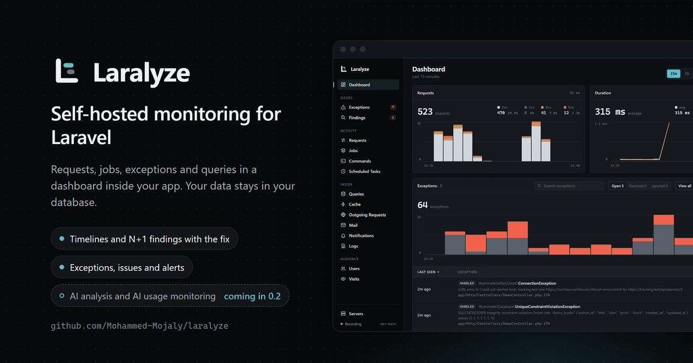
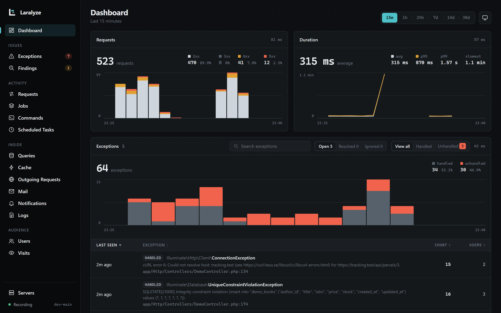
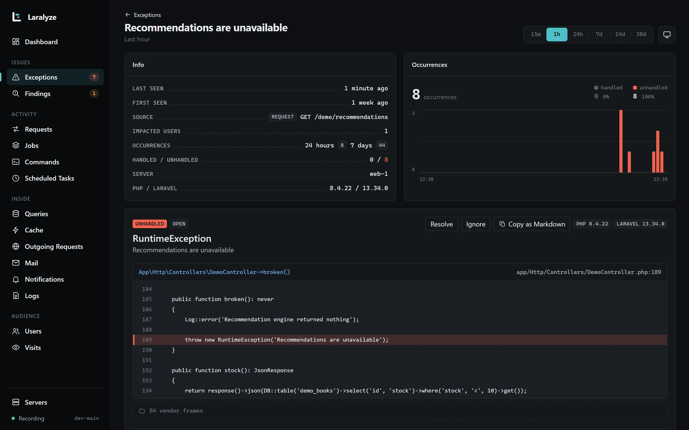
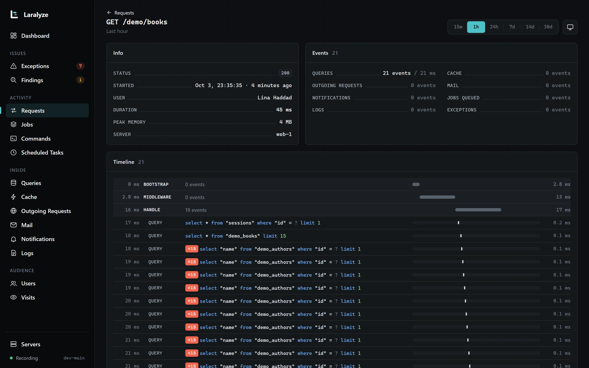

<p align="center"></p>

<p align="center">
    <a href="https://github.com/Mohammed-Mojaly/laralyze/actions/workflows/tests.yml"></a>
    <a href="https://packagist.org/packages/mohammed-mojaly/laralyze"></a>
    <a href="LICENSE.md"></a>
</p>

# Laralyze

Self-hosted production monitoring for Laravel. A dashboard inside your app shows requests, jobs, queries, exceptions, cache, outgoing HTTP, AI calls, mail, notifications, logs, users, servers and visits; timelines of single requests and jobs; N+1 and duplicate queries; and alerts by mail, Slack or Discord. Near-zero overhead, and your data stays in your database.

**Why Laralyze:** Pulse shows totals, Nightwatch shows details but runs as a hosted service with event quotas. Laralyze gives you both in your own app and database, with no quotas: timelines of single requests, jobs and commands, N+1 findings with the fix, issue tracking and alerts, on MySQL, MariaDB, PostgreSQL, SQLite or SQL Server.

> Laralyze is in `0.x`: things may change between minor releases (`0.1` → `0.2`) until `1.0`. Patch releases (`0.1.1`) never break anything. See the [changelog](CHANGELOG.md) before you upgrade.

## Requirements

- PHP 8.3+
- Laravel 12.69.2+ or 13.32+
- Livewire 3.8.3+ or 4.3.4+ (installed for you; your app doesn't need to use it). Earlier releases have a known XSS issue.
- MySQL, MariaDB, PostgreSQL, SQLite or SQL Server

## Installation

```bash
composer require mohammed-mojaly/laralyze
php artisan laralyze:install
```

Then open `/laralyze`. Restart your queue workers (`php artisan queue:restart`, or `php artisan horizon:terminate` with Horizon): a worker loads Laralyze when it starts, so one that was already running won't record its jobs. Make sure Laravel's scheduler runs (`* * * * * php artisan schedule:run`): Laralyze uses it for cleanup, server stats and alerts. If something is off (tables missing, the scheduler not running, writes failing), you see a warning above the cards and in `php artisan about`. See [when something is wrong](docs/runtime.md#when-something-is-wrong).

## What you get

| Page | Shows |
|---|---|
| Dashboard | Requests, timings, exceptions, queues and slow requests at a glance |
| Requests | Throughput by status class, avg/p95/p99, every route, slow requests |
| Jobs | Queued, processed, released, failed per queue; wait times; every job class |
| Commands, Scheduled Tasks | Runs, failures, durations; last and next run of each task |
| Exceptions | Grouped by class and line, with users affected and open, resolved or ignored status |
| Findings | N+1 and duplicate queries, with the line in your code and the fix |
| Timelines | Single requests, jobs and commands with everything inside them, in order |
| Queries | Time per query, reads vs writes, slow queries with the line that ran them |
| Cache | Hit ratio and hits, misses, writes and deletes per key group |
| Outgoing Requests | Calls to other services, errors and connections that never got a response |
| AI | Calls made with `laravel/ai`: tokens, estimated cost, duration and failures per agent, model and user |
| Mail, Notifications | Sent and failed, per mailable, notification and channel |
| Users, Visits | Signed-in users and what they hit; visitors, pages, devices, browsers and bots |
| Logs, Servers | Log levels; CPU, memory and disk |

**Exceptions**

- A page per exception: the latest stack trace with the code around your own lines, previous exceptions and context.
- Resolve or ignore it. A resolved exception reopens when it happens again.
- Copy as Markdown, ready to paste into an issue or an AI chat.

**Timelines**

- Every query, cache call, outgoing request, AI call and the tools it used, mail, notification, queued job, log and exception, in order and split into stages (bootstrap, middleware, handle, terminating).
- Jobs link to the request or command that queued them, and to their other attempts.
- Slow, failed and throwing runs are always kept; the rest are sampled.

Each page shows the last 15 minutes, hour, 24 hours, 7, 14 or 30 days. Lists can be searched and sorted, and every route, job, command, query and outgoing URL opens a page of its own. Every recorder can be turned off; its page goes with it.

## Screenshots

<p align="center"></p>
<p align="center"></p>
<p align="center"></p>

## AI calls

If your app uses [`laravel/ai`](https://github.com/laravel/ai) (0.6 or later), the AI page shows every agent, embedding, image, audio and transcription call: tokens in and out, estimated cost, duration, p95 and failures, per agent, per model and per user. Nothing to add to your code.

- Costs come from each model's price per token, from [OpenRouter's public list](https://openrouter.ai/api/v1/models). Laralyze ships the prices; `php artisan laralyze:ai-prices` fetches today's, and you can set your own in config.
- Prompts and responses are never recorded.
- Each AI call shows in the timeline of its request or job, with the tools it called.

See [AI in the configuration docs](docs/configuration.md#ai).

## Alerts

Set at least one channel and Laralyze checks every minute from your scheduler:

```env
LARALYZE_ALERTS_MAIL=ops@example.com,cto@example.com
LARALYZE_ALERTS_SLACK_WEBHOOK=https://hooks.slack.com/services/...
LARALYZE_ALERTS_DISCORD_WEBHOOK=https://discord.com/api/webhooks/...
```

You hear about new exceptions, resolved ones that come back, more than 5% of requests failing, and 10 or more failed jobs in 5 minutes. The same alert is sent at most once an hour (`LARALYZE_ALERTS_EVERY`, in minutes). Change the rules in `alerts.rules`.

## Privacy

Laralyze stores counts and timings, not payloads. SQL is kept with `?` in place of values; query bindings, request bodies and cache values are never recorded. Outgoing URLs lose their query string. Exceptions keep file, line and function names, never arguments, with a few lines of your own code around each app frame. Visits never store IP addresses or user agents, and guests are told apart by a hash that changes daily. Timelines are kept 7 days by default. Drop anything else you consider sensitive with `Laralyze::filter()`.

## Authorization

Outside the `local` environment, nobody can open Laralyze until you allow it:

```php
use Illuminate\Support\Facades\Gate;

Gate::define('viewLaralyze', function ($user) {
    return $user->isAdmin();
});
```

The gate is checked on the page and on every card update.

## Your own metrics

```php
use MohammedMojaly\Laralyze\Facades\Laralyze;

Laralyze::record('checkout', $plan, $total)->count()->sum()->max();
```

Then show them with a card of your own: `php artisan laralyze:make-card CheckoutFunnel`.

## What's next

An optional AI assistant, through [`laravel/ai`](https://github.com/laravel/ai) and the provider you choose:

- Explain an exception, an N+1 or a slow query and how to fix it, from what Laralyze already keeps.
- Hand you a prompt to paste into your own coding agent.

Nothing is sent anywhere unless you turn it on.

## Documentation

- [Configuration](docs/configuration.md): every setting and recorder
- [Customization](docs/customization.md): pages, cards, recorders, filters, theme
- [Running in production](docs/runtime.md): overhead, scheduler, FPM, Octane, queues, several servers

## Contributing and security

See [CONTRIBUTING.md](CONTRIBUTING.md). Please report security issues privately, as described in [SECURITY.md](SECURITY.md).

## Credits

Created and maintained by [Mohammed Mojaly](https://github.com/Mohammed-Mojaly).

Brand icons for systems, browsers, bots and AI providers come from [Simple Icons](https://simpleicons.org) (CC0). The trademarks belong to their owners.

## License

MIT. See [LICENSE.md](LICENSE.md).
