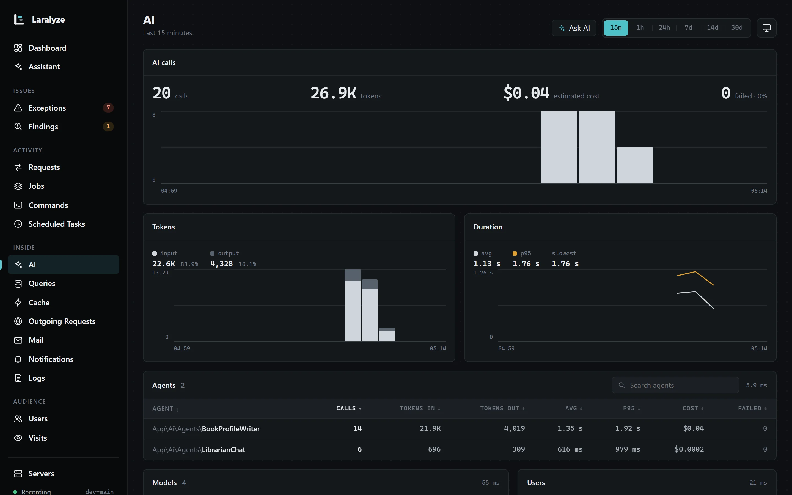

<p align="center"></p>

<p align="center">
    <a href="https://github.com/Mohammed-Mojaly/laralyze/actions/workflows/tests.yml"></a>
    <a href="https://packagist.org/packages/mohammed-mojaly/laralyze"></a>
    <a href="LICENSE.md"></a>
</p>

# Laralyze

Laralyze records what your Laravel app does in production and shows it on a dashboard inside the app: requests, jobs, commands, queries, exceptions, cache, outgoing HTTP, AI calls, mail, notifications, logs, users, servers and visits, and the timeline of single requests and jobs. The data stays in your app's database, or in ClickHouse if you choose. It adds about 0.03–0.08 ms to a simple request and about 2 ms to one with 1,000 queries ([measured](docs/runtime.md#overhead) with PHP 8.4 and SQLite).

> Laralyze is in `0.x`: minor releases (`0.1` → `0.2`) may change things until `1.0`; patch releases don't. Read the [changelog](CHANGELOG.md) before you upgrade.

## Requirements

- PHP 8.3+
- Laravel 12.69.2+ or 13.32+
- Livewire 3.8.3+ or 4.3.4+ (installed for you). Earlier releases have a known XSS issue.
- MySQL, MariaDB, PostgreSQL, SQLite or SQL Server, or ClickHouse 24.8+

For medium and large apps, we recommend [ClickHouse](docs/configuration.md#clickhouse): it keeps Laralyze's writes off your app's database, and the dashboard stays fast as data grows.

## Installation

```bash
composer require mohammed-mojaly/laralyze
php artisan laralyze:install
```

Then open `/laralyze`.

Restart your queue workers (`php artisan queue:restart`) so they load Laralyze, and make sure Laravel's scheduler runs. If something is off, the dashboard and `php artisan about` say what ([details](docs/runtime.md#when-something-is-wrong)).

## What you get

| Page | Shows |
|---|---|
| Dashboard | What needs attention, requests, exceptions, queues, slow requests and jobs |
| Requests | Requests by status, avg and p95/p99, every route |
| Jobs, Commands, Scheduled Tasks | Runs, failures, durations, wait times; last and next run of each task |
| Exceptions | Grouped by class and line, with stack trace, users affected and open, resolved or ignored status |
| Findings | Possible N+1 and duplicate queries, with the line in your code |
| Timelines | A single request, job or command with everything inside it, in order |
| Queries, Cache, Outgoing Requests | Time per query, slow queries; cache hits and misses; calls to other services |
| AI | Calls made with `laravel/ai`: tokens, estimated cost, duration and failures |
| Mail, Notifications, Logs | Sent and failed; log levels |
| Users, Visits, Servers | Signed-in users; visitors, pages, devices; CPU, memory and disk |

Each page shows the last 15 minutes to 30 days. Every recorder can be turned off, and its page goes with it.

<p align="center"></p>
<p align="center"></p>

## Privacy

Laralyze stores counts and timings, not payloads. SQL keeps `?` in place of values; bindings, request bodies and cache values aren't stored, and outgoing URLs lose their query string. Exceptions keep file, line and function names, never arguments; secrets in their context and in the code around each frame are masked. Visits don't store IP addresses or user agents.

Keep anything else out with [`Laralyze::filter()`](docs/customization.md#keep-data-out). With Ask AI, what Laralyze recorded about the subject and the code the assistant reads go to your AI provider when someone asks, and only then; with a local model such as Ollama, they stay on your servers. See the [known limits](docs/limits.md).

## Authorization

Outside the `local` environment, nobody can open Laralyze until you allow it:

```php
Gate::define('viewLaralyze', fn ($user) => $user->isAdmin());
```

The gate is checked on the page and on every card update.

`Gate::define('useLaralyzeAssistant', ...)` decides who may use Ask AI; by default, the same people who may view the dashboard.

## Documentation

- [Configuration](docs/configuration.md): every setting and recorder
- [AI calls](docs/configuration.md#ai): tokens and estimated cost of `laravel/ai` calls
- [Ask AI](docs/configuration.md#ask-ai): a chat on every page that answers from what Laralyze recorded
- [ClickHouse](docs/configuration.md#clickhouse): keep Laralyze's data out of your app's database
- [Alerts](docs/configuration.md#alerts): mail, Slack or Discord
- [Customization](docs/customization.md): pages, cards, your own metrics and recorders, filters, theme
- [Running in production](docs/runtime.md): overhead, the scheduler, several servers, Octane
- [Known limits](docs/limits.md): what Laralyze doesn't see, and what is estimated

## Contributing and security

See [CONTRIBUTING.md](CONTRIBUTING.md). Please report security issues privately, as described in [SECURITY.md](SECURITY.md).

## Credits

Created and maintained by [Mohammed Mojaly](https://github.com/Mohammed-Mojaly). Brand icons come from [Simple Icons](https://simpleicons.org) (CC0); the trademarks belong to their owners.

## License

MIT. See [LICENSE.md](LICENSE.md).
